# **StatEdu Studio** 사용자 안내서

이 문서는 **StatEdu Studio** 버전 1.0.0을 실제로 사용하는 절차를 설명합니다. 앱 실행, 데이터 열기, 변수 선택, 분석 실행, 결과 저장처럼 사용자가 화면에서 따라 해야 하는 작업 흐름을 다룹니다. 구현된 분석 기법 목록은 `ANALYSIS_METHODS_KO.md`, 방법 선택 기준과 해석상 주의점은 `METHOD_NOTES_KO.md`를 참고합니다.

## 1. 앱 실행

**StatEdu Studio**는 Windows PC에서 로컬로 실행되는 Shiny 앱입니다. 데이터는 사용자의 PC에서 분석되며 외부 서버로 전송되지 않습니다.

1. **StatEdu Studio** 폴더를 엽니다.
2. `StatEdu_Studio.bat`을 더블클릭합니다.
3. 브라우저가 열리면 `127.0.0.1:7894` 주소에서 앱을 사용합니다.

같은 포트에서 이전 **StatEdu Studio** 세션이 실행 중이면 런처가 해당 세션을 정리한 뒤 새 세션을 시작합니다.

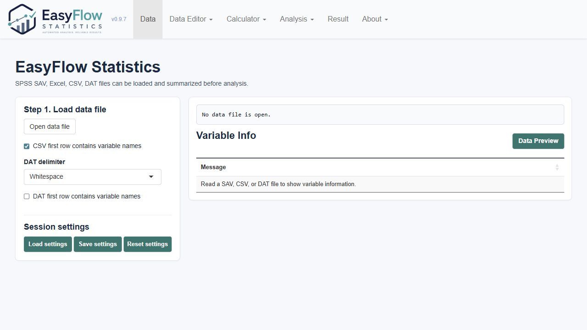

## 2. 화면 액션 오버레이로 따라 하기

아래 예시는 데이터 파일을 불러오고, 분석 변수를 선택하고, `t-test / ANOVA`를 실행한 뒤 논문용 결과표를 확인하는 과정을 순서대로 보여줍니다. 초록색 플래시 박스는 실제로 사용자가 클릭하거나 확인해야 하는 위치입니다.

  

    

      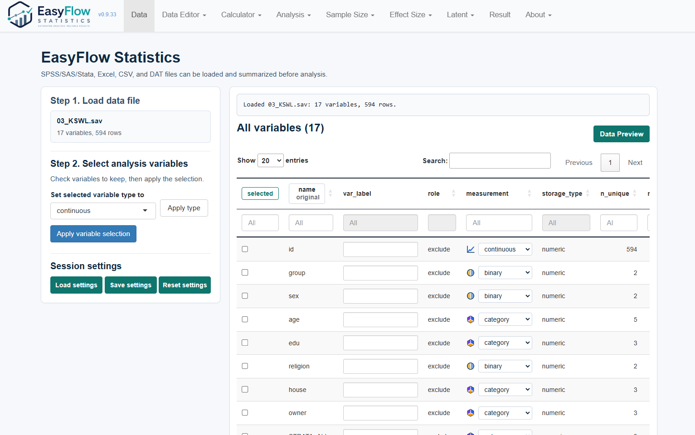
      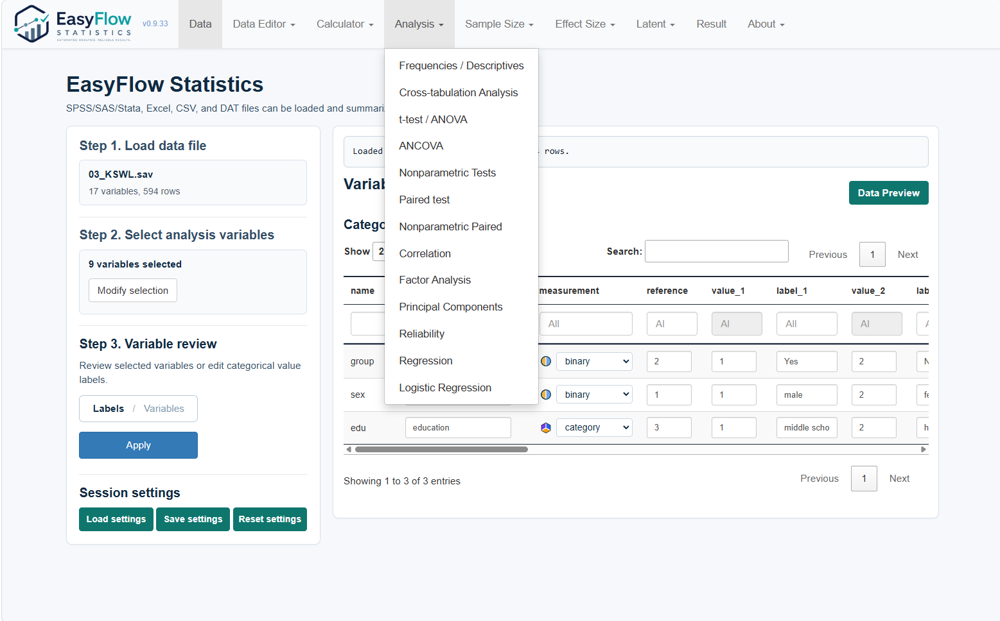
      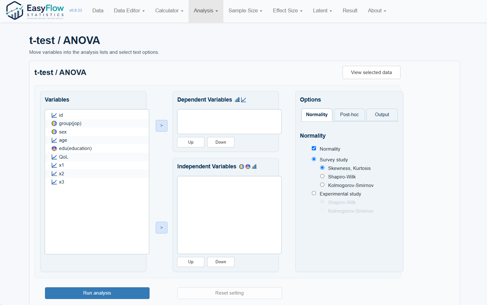
      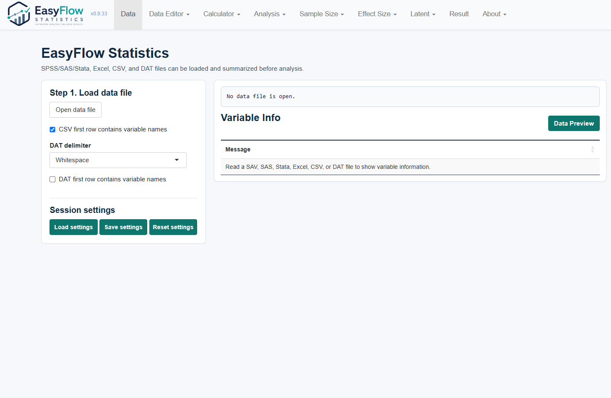
      
      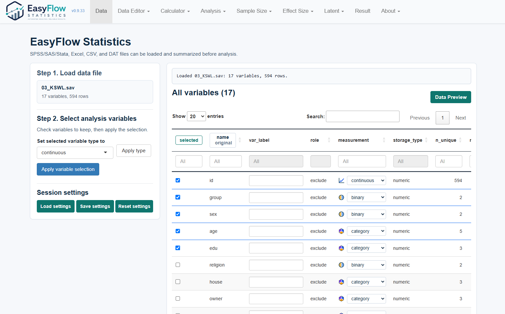
      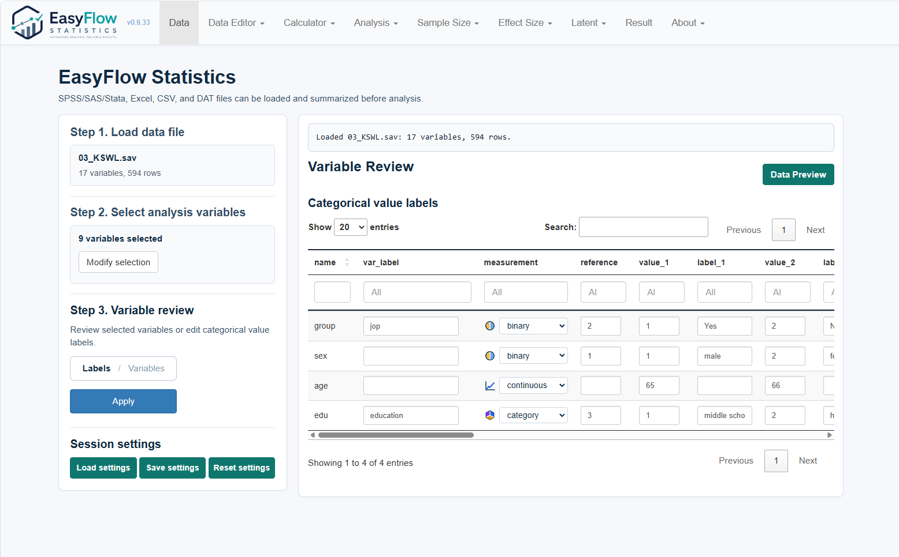
      
      
      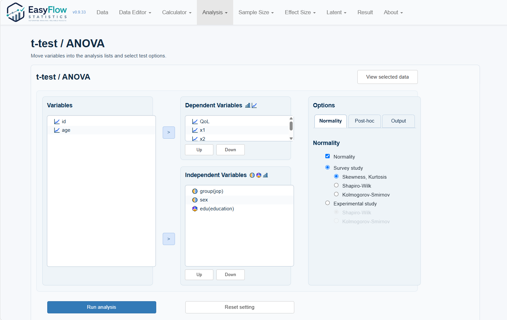
      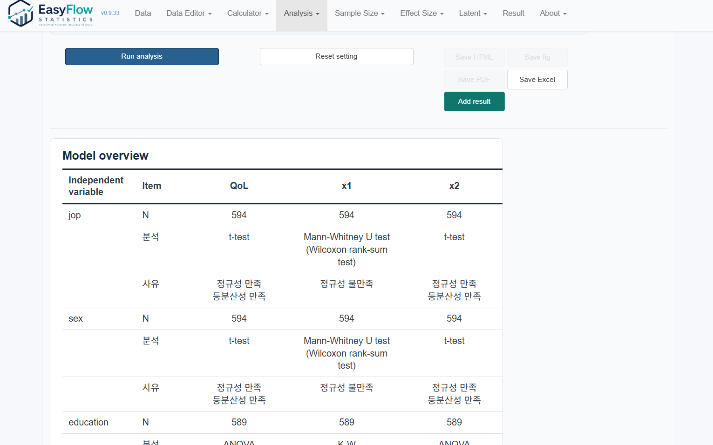
      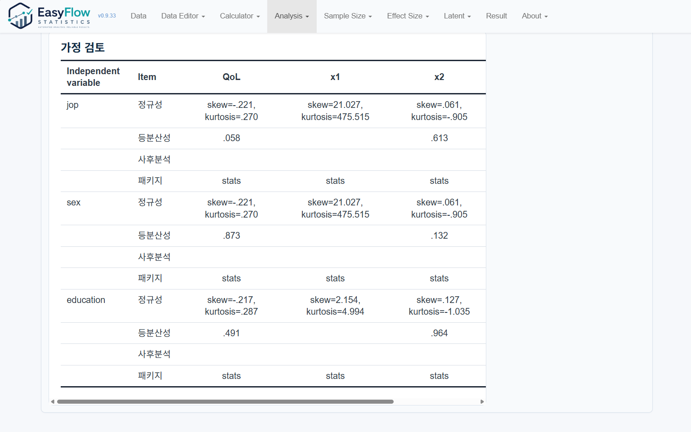
      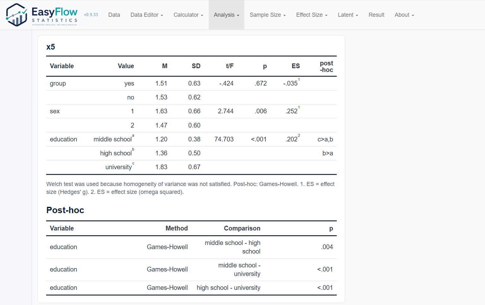
      

        
<b>Open data file</b>

        
<b>Checkbox</b>

        
<b>Selected checkbox</b>

        
<b>Apply variable selection</b>

        
<b>age: continuous</b>

        
<b>job labels</b>

        
<b>Apply</b>

        
<b>t-test / ANOVA</b>

        
<b>QoL - x3</b>

        
<b>Select</b>

        
<b>Dependent variables</b>

        
<b>Independent variables</b>

        
<b>Run analysis</b>

        
<b>QoL table</b>

      

    

  

  
초록색 플래시 박스는 각 단계에서 눌러야 할 위치와 확인해야 할 영역을 순서대로 강조합니다.

  <article class="efs-guide-step"><strong>1. 데이터 준비</strong>파일을 불러오고 분석에 사용할 변수를 선택합니다.</article>
  <article class="efs-guide-step"><strong>2. 분석 선택</strong>Analysis 메뉴에서 t-test / ANOVA를 선택하고 종속변수와 독립변수를 지정합니다.</article>
  <article class="efs-guide-step"><strong>3. 결과 확인</strong>분석 가정과 변수 유형에 맞는 결과를 논문용 표 형태로 확인합니다.</article>

## 3. 데이터 열기

Data 메뉴에서 SPSS SAV, Excel, CSV, DAT 파일을 불러옵니다. 파일을 연 뒤에는 원자료 표, 변수명, 변수 라벨, 값 라벨을 확인합니다.

데이터를 불러온 직후에는 다음을 먼저 확인하는 것이 좋습니다.

- 변수명이 분석에 사용할 수 있는 형태인지 확인합니다.
- 값 라벨이 의도한 범주와 맞는지 확인합니다.
- 결측값 코드가 실제 결측으로 처리되어야 하는지 확인합니다.
- 숫자로 저장된 범주형 변수의 measurement level을 확인합니다.

## 4. 데이터 편집과 전처리

Data Editor 메뉴에는 분석 전 정리 작업을 위한 기능이 모여 있습니다.

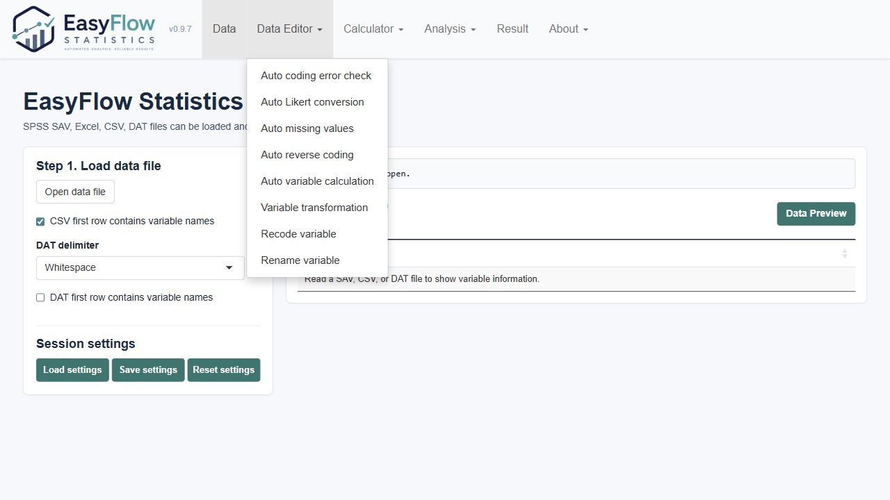

주요 기능은 다음과 같습니다.

- Auto Coding Error Check: 범위 밖 값이나 정수로 입력되어야 하는 변수의 오류를 확인합니다.
- Auto Likert Conversion: 텍스트 Likert 응답을 숫자형 점수로 변환합니다.
- Auto Missing Values: 결측값으로 보이는 코드를 찾아 `NA`로 처리합니다.
- Auto Reverse Coding: 역문항을 새 변수로 생성합니다.
- Auto Variable Calculation: 여러 변수의 행 단위 합계나 평균을 계산합니다.
- Variable Transformation: 빠른 공식 또는 사용자 식으로 새 변수를 만듭니다.
- Recode Variable: 기존 값을 다른 값으로 재코딩합니다.
- Rename Variable: 변수명과 라벨을 정리합니다.

## 5. 변수 속성 확인

분석 전 Step 3에서 measurement level을 반드시 확인합니다. **StatEdu Studio**는 measurement level을 바탕으로 가능한 분석 방법을 자동 또는 반자동으로 선택합니다.

- `continuous`: 평균 비교, 상관, 회귀 등에 사용합니다.
- `ordered`: 순서형 범주 또는 ordinal 문항으로 사용합니다.
- `binary`: 두 수준의 범주형 변수로 사용합니다.
- `category`: 순서가 없는 범주형 변수로 사용합니다.

## 6. 분석 메뉴 사용

Analysis 메뉴에서 분석 종류를 선택합니다.

분석 화면의 기본 흐름은 대체로 같습니다.

1. 왼쪽 변수 목록에서 변수를 선택합니다.
2. 종속변수, 독립변수, 그룹 변수, 반복측정 변수 등 필요한 영역으로 변수를 이동합니다.
3. 옵션을 선택합니다.
4. Run 버튼으로 분석을 실행합니다.
5. 결과표, 경고, skipped analyses 또는 skipped models를 확인합니다.

### Generalized Linear Model (GLM) 사용 절차

독립 관측자료에서 연속형, 이분형, 양수 편향형, count outcome을 회귀분석할 때는 `Analysis > Generalized Linear Model (GLM)`을 사용합니다. 반복측정, 군집자료, 패널자료용 종단/패널 분석은 public 1.0에서는 숨겨져 있으며 이후 Pro 기능으로 분리할 예정입니다.

1. 왼쪽 `Variables` 목록에서 종속변수를 선택한 뒤 `Dependent variable`로 이동합니다. 종속변수는 하나만 지정합니다.
2. 설명변수는 `Independent variables`로 이동합니다. 순서는 `Up`, `Down` 버튼으로 조정할 수 있습니다.
3. rate 또는 person-time 분석처럼 노출량 보정이 필요하면 하나의 양수 변수를 `Exposure / offset`에 지정합니다.
4. `Options > Model`에서 outcome family와 link function을 선택합니다. Auto를 선택하면 프로그램이 변수 유형과 값 구조로 Gaussian, Binary, Gamma, Count 후보를 판정합니다.
5. Count outcome은 Poisson과 negative binomial을 따로 고르지 않고 `Count`로 선택합니다. 프로그램이 Poisson dispersion, zero screen, 가능한 AIC/BIC 정보를 확인해 Poisson 또는 negative binomial 결과를 보고합니다.
6. `Options > Missing`에서 complete-case, MI, IPW 중 결측 처리 또는 결측 민감도 분석 방식을 선택합니다.
7. `Options > Checks`에서 family/link, 잔차 또는 과분산, separation/sparse cell, 영향점, VIF 등 필요한 가정 검토를 선택합니다.
8. `Run GLM`을 눌러 분석을 실행하고, 결과에서 decision summary, coefficient table, assumption checks, missing-data summary, software versions를 확인합니다.

### 종단 / 패널 분석

반복측정, 군집자료, 패널자료처럼 한 대상 또는 군집에서 여러 시점의 관측값이 있는 long-format 데이터는 public 1.0에서는 별도 공개 메뉴로 제공하지 않습니다. 내부 검증 빌드에서는 사용할 수 있지만, public 1.0 사용자 문서에서는 정식 제공 기능으로 안내하지 않습니다.

1. Data 탭에서 Step 2 변수 선택을 적용합니다.
2. 왼쪽 `Variables` 목록에서 변수를 선택한 뒤 `>` 버튼으로 `Model variables` 영역에 이동합니다.
3. `Dependent variable`, `Subject ID`, `Cluster ID (optional)`, `Time variable`은 각각 하나씩만 지정합니다.
4. 설명변수는 `Independent variables`에 여러 개 지정할 수 있습니다.
5. `Options > Model`에서 분석기법을 선택합니다. GEE와 GLMM은 outcome family와 관련 옵션을 표시합니다. Count outcome은 Poisson과 negative binomial을 따로 고르지 않고 `Count: Poisson or negative binomial / log`로 선택하면, 프로그램이 과분산 screening 후 최종 family를 결정합니다. LMM / GLMM은 random slope 옵션을 `Terms` 탭에 표시합니다. Panel FE / RE는 패널모형에 필요한 옵션만 표시합니다.
6. `Options > Missing`에서 결측 처리 방식을 선택합니다. LMM / GLMM의 기본값은 `Likelihood-based MAR: available repeated measures`이며, 관측된 반복측정 행을 사용해 mixed-model likelihood를 적합합니다. 한 방문의 outcome 결측 때문에 대상자 전체를 제거하지는 않지만, 해당 모델 행의 outcome, 공변량, ID, time 결측은 대체하지 않습니다. 공변량 결측이나 dropout 메커니즘이 중요하면 MI 또는 IPW를 민감도 분석으로 추가합니다.
7. `Options > Checks`에서 가정 검토를 켜고, 선택한 분석기법에 맞는 세부 가정 항목을 선택합니다.
8. `Run model`을 눌러 분석을 실행합니다.
9. 결과에서 model overview, data structure, missing data, publication-ready estimates, assumption checks, recommended analysis, sensitivity analysis results, manuscript text, SCI reporting checklist를 확인합니다.

모형 선택은 연구 질문에 맞춰 결정합니다. GEE는 population-averaged effect, LMM / GLMM은 subject-specific effect, Panel FE는 within-unit change와 time-invariant confounding 통제, Panel RE는 unit effect가 predictors와 독립이라는 가정이 타당할 때 사용합니다.

## 7. 결과 확인

Result 탭에서는 실행한 분석 결과를 모아 봅니다. 결과는 분석별 표, 경고, 진단 결과, 저장 옵션으로 구성됩니다.

결과를 해석할 때는 p 값만 보지 말고 다음을 함께 확인합니다.

- 어떤 분석 방법이 선택되었는가
- Warnings가 있는가
- Skipped analyses 또는 skipped models가 있는가
- 효과크기와 신뢰구간이 결론과 같은 방향인가
- 표본 수와 결측 처리 방식이 충분한가

## 8. 결과 저장

Result 탭에서 public 1.0은 HTML, PDF 형식 저장을 제공합니다. Excel, Word 결과 저장은 public 1.0에서는 숨겨져 있으며 이후 Pro 기능으로 분리할 예정입니다. 저장 결과에는 화면에 표시된 분석표와 주요 경고가 포함됩니다.

보고서나 논문에 사용할 때는 저장된 표를 그대로 붙이기보다, 분석 방법과 가정 진단 결과를 함께 서술하는 것이 좋습니다.

## 9. About과 문서

About 메뉴에는 순수 About 정보와 문서가 분리되어 있습니다.

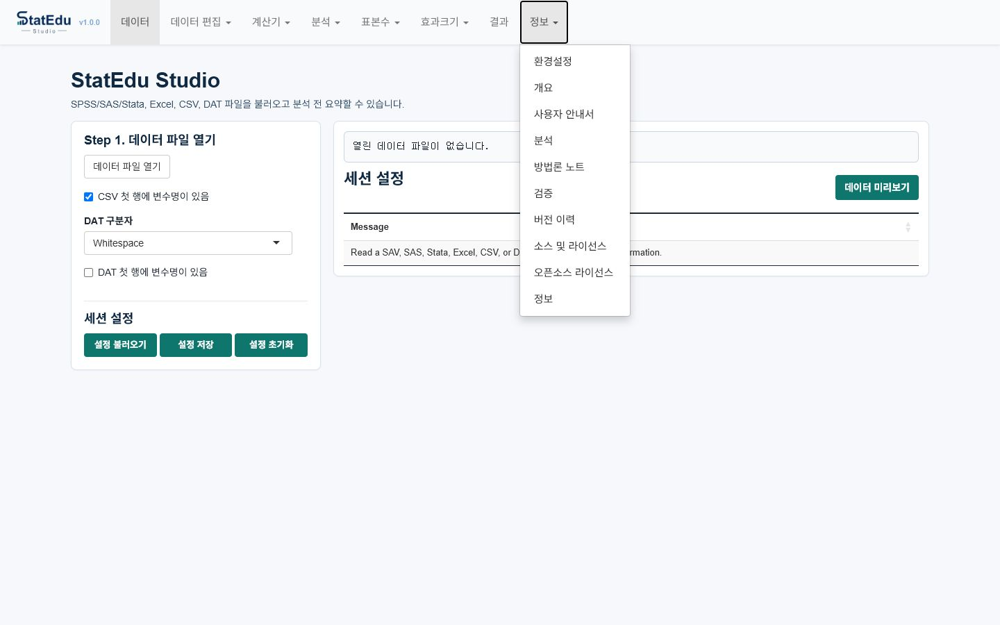

- About: 버전, 개발자, 이메일, 실행 환경, 인용 정보를 확인합니다.
- Overview: 프로젝트 개요, R 버전, 사용 R 패키지 정보를 확인합니다.
- User Guide: 실제 앱 조작 절차를 확인합니다.
- Analysis Methods: 구현된 분석 메뉴와 출력 항목을 확인합니다.
- Method Notes: 기준값, 가정 진단, 참고문헌, 해석상 주의점을 확인합니다.

## 10. Sample Size, Power, Effect Size 메뉴

버전 1.0.0 기준으로 Sample Size와 Effect Size 메뉴가 별도 상위 메뉴로 제공된다. 이 메뉴는 연구계획 단계에서 필요한 최소 표본 수 `n`, 이미 정한 표본 수에서의 검정력, 그리고 표본수 계산에 넣을 효과크기를 계산하기 위한 도구다.

### Sample Size 사용 절차

1. 상단 메뉴에서 `Sample Size`를 선택한다.
2. 분석 계열을 선택한다. 예: `t-test`, `ANOVA`, `ANCOVA / MANOVA`, `GEE`, `LMM`, `Regression`, `Survival / Cox`, `ROC AUC`, `SEM / CFA`.
3. 왼쪽 `1. Calculate`에서 `Required sample size` 또는 `Power`를 선택한다. 단, Reliability / Agreement처럼 정밀도 기반 표본 수만 제공되는 메뉴는 `Required sample size`만 표시된다.
4. 가운데 `2. Inputs`에 효과크기, 유의수준, 목표 검정력, 배정비, 탈락률 같은 가정을 입력한다.
5. `Calculate`를 누르면 오른쪽 `3. Results`에 계산 결과가 표시된다.
6. 시간이 오래 걸리는 시뮬레이션 기반 계산은 진행률 막대와 `Stop` 버튼이 표시된다. 중단하면 현재 계산을 종료하고 결과 영역에 중단 상태가 표시된다.

### 결과 읽는 법

- 최종 최소 표본 수는 결과 표에서 굵게 표시되는 `n (...)` 행을 먼저 확인한다.
- `n (... with dropout)`이 있으면 탈락률을 반영한 표본 수다.
- `Estimated power`는 산출된 표본 수에서 다시 계산한 검정력이다.
- `Formula / approximation`은 앱이 사용한 수식 또는 근사 방식을 요약한다.
- `References`는 해당 계산의 근거 문헌이다.

### Effect Size 사용 절차

1. 상단 메뉴에서 `Effect Size`를 선택한다.
2. 분석 계열을 선택한다.
3. 가능한 입력 방식 중 하나를 선택한다. 예: 평균과 표준편차에서 Cohen's d 계산, t 통계량에서 Pearson r 계산, ANCOVA F 통계량에서 partial eta squared 계산, SPSS LMM 출력에서 partial eta squared 또는 paired dz 계산, GLMM fixed effect에서 OR/IRR 또는 latent-scale d 계산.
4. `Calculate`를 누르면 선택한 효과크기와 변환 가능한 보조 효과크기가 함께 표시된다.

Effect Size 메뉴는 실제 효과크기 또는 표본수 계획에 직접 들어가는 효과크기를 중심으로 정리되어 있다. 동등성/비열등성 margin distance, 일반 신뢰구간 정밀도, SEM/CFA 복잡도 규칙처럼 효과크기라기보다 계획 기준에 가까운 항목은 Sample Size 또는 관련 메뉴에서 다룬다.

### 입력값 선택 팁

- 목표 검정력 기본값은 `.95`다. 연구 분야에서 `.80`을 요구하면 직접 바꿀 수 있다.
- 회귀, 포아송, 음이항, 감마 회귀의 `Regression coefficient B`는 log link 모형의 계수다. 비율 효과는 `ratio = exp(B)`로 해석한다.
- LMM과 GEE의 unstructured correlation은 시간점 사이의 pairwise correlation을 입력한다. 세 시점이면 `r12, r13, r23` 순서로 입력한다.
- SPSS LMM 출력에서 omnibus 효과는 `F`, numerator df, denominator df로 partial eta squared를 계산하고, 시간점 간 비교는 평균차와 공분산 행렬의 분산/공분산으로 paired dz를 계산한다. 둘 중 한 종류만 입력해도 계산할 수 있다.
- GLMM/GEE의 logit 또는 log link 계수는 평균차가 아니라 log odds 또는 log rate 척도다. GEE는 population-average 효과, GLMM은 subject-specific 효과로 해석한다.
- SEM/CFA는 model degrees of freedom을 직접 넣거나, latent variables, measured variables, structural paths로 근사 df를 계산하게 할 수 있다.
