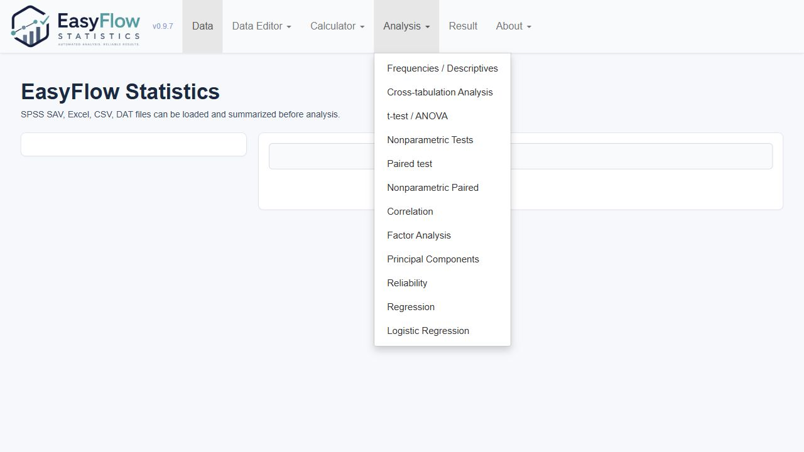
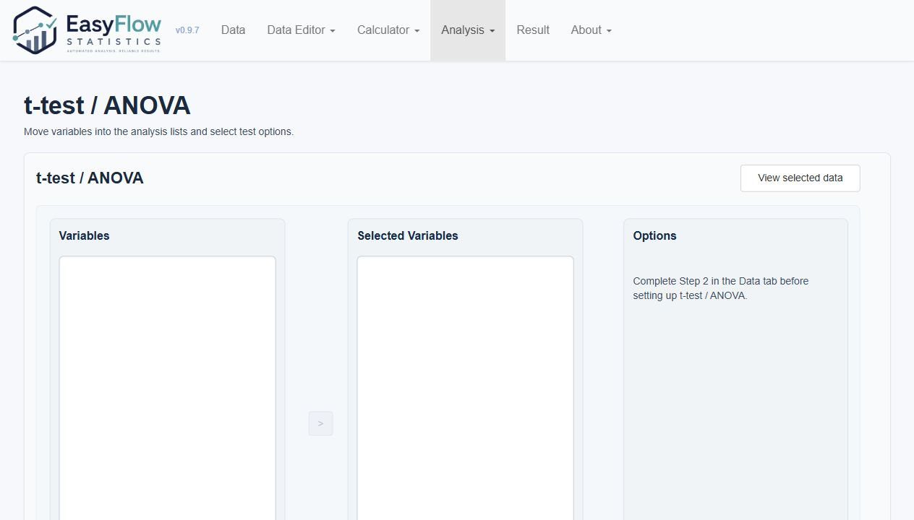
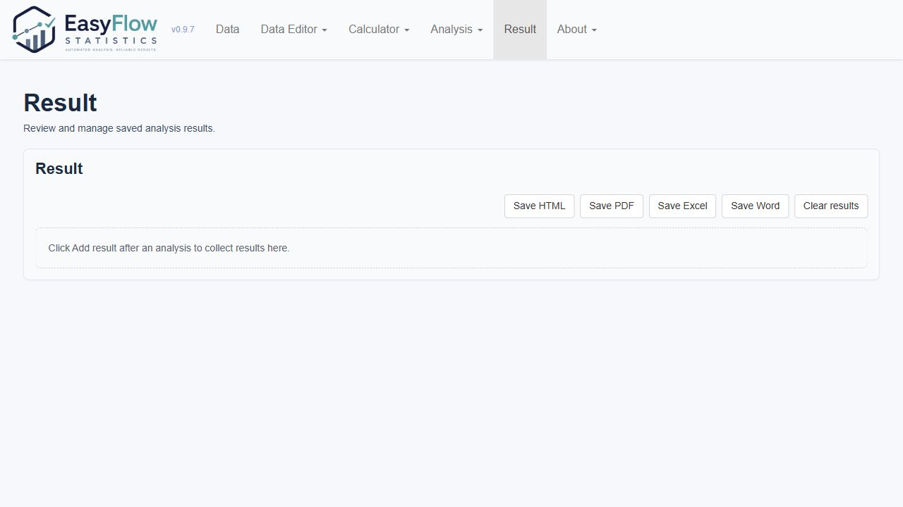

# **EasyFlow Statistics** 사용자 안내서

이 문서는 **EasyFlow Statistics** 0.9.32를 실제로 사용하는 절차를 설명합니다. 앱 실행, 데이터 열기, 변수 선택, 분석 실행, 결과 저장처럼 사용자가 화면에서 따라 해야 하는 작업 흐름을 다룹니다. 구현된 분석 기법 목록은 `ANALYSIS_METHODS_KO.md`, 방법 선택 기준과 해석상 주의점은 `METHOD_NOTES_KO.md`를 참고합니다.

## 1. 앱 실행

**EasyFlow Statistics**는 Windows PC에서 로컬로 실행되는 Shiny 앱입니다. 데이터는 사용자의 PC에서 분석되며 외부 서버로 전송되지 않습니다.

1. **EasyFlow Statistics** 폴더를 엽니다.
2. `EasyFlow_Statistics.bat`을 더블클릭합니다.
3. 브라우저가 열리면 `127.0.0.1:7894` 주소에서 앱을 사용합니다.

같은 포트에서 이전 **EasyFlow Statistics** 세션이 실행 중이면 런처가 해당 세션을 정리한 뒤 새 세션을 시작합니다.

## 2. 데이터 열기

Data 메뉴에서 SPSS SAV, Excel, CSV, DAT 파일을 불러옵니다. 파일을 연 뒤에는 원자료 표, 변수명, 변수 라벨, 값 라벨을 확인합니다.

데이터를 불러온 직후에는 다음을 먼저 확인하는 것이 좋습니다.

- 변수명이 분석에 사용할 수 있는 형태인지 확인합니다.
- 값 라벨이 의도한 범주와 맞는지 확인합니다.
- 결측값 코드가 실제 결측으로 처리되어야 하는지 확인합니다.
- 숫자로 저장된 범주형 변수의 measurement level을 확인합니다.

## 3. 데이터 편집과 전처리

Data Editor 메뉴에는 분석 전 정리 작업을 위한 기능이 모여 있습니다.

주요 기능은 다음과 같습니다.

- Auto Coding Error Check: 범위 밖 값이나 정수로 입력되어야 하는 변수의 오류를 확인합니다.
- Auto Likert Conversion: 텍스트 Likert 응답을 숫자형 점수로 변환합니다.
- Auto Missing Values: 결측값으로 보이는 코드를 찾아 `NA`로 처리합니다.
- Auto Reverse Coding: 역문항을 새 변수로 생성합니다.
- Auto Variable Calculation: 여러 변수의 행 단위 합계나 평균을 계산합니다.
- Variable Transformation: 빠른 공식 또는 사용자 식으로 새 변수를 만듭니다.
- Recode Variable: 기존 값을 다른 값으로 재코딩합니다.
- Rename Variable: 변수명과 라벨을 정리합니다.

## 4. 변수 속성 확인

분석 전 Step 3에서 measurement level을 반드시 확인합니다. **EasyFlow Statistics**는 measurement level을 바탕으로 가능한 분석 방법을 자동 또는 반자동으로 선택합니다.

- `continuous`: 평균 비교, 상관, 회귀 등에 사용합니다.
- `ordered`: 순서형 범주 또는 ordinal 문항으로 사용합니다.
- `binary`: 두 수준의 범주형 변수로 사용합니다.
- `category`: 순서가 없는 범주형 변수로 사용합니다.

## 5. 분석 메뉴 사용

Analysis 메뉴에서 분석 종류를 선택합니다.

분석 화면의 기본 흐름은 대체로 같습니다.

1. 왼쪽 변수 목록에서 변수를 선택합니다.
2. 종속변수, 독립변수, 그룹 변수, 반복측정 변수 등 필요한 영역으로 변수를 이동합니다.
3. 옵션을 선택합니다.
4. Run 버튼으로 분석을 실행합니다.
5. 결과표, 경고, skipped analyses 또는 skipped models를 확인합니다.

## 6. 결과 확인

Result 탭에서는 실행한 분석 결과를 모아 봅니다. 결과는 분석별 표, 경고, 진단 결과, 저장 옵션으로 구성됩니다.

결과를 해석할 때는 p 값만 보지 말고 다음을 함께 확인합니다.

- 어떤 분석 방법이 선택되었는가
- Warnings가 있는가
- Skipped analyses 또는 skipped models가 있는가
- 효과크기와 신뢰구간이 결론과 같은 방향인가
- 표본 수와 결측 처리 방식이 충분한가

## 7. 결과 저장

Result 탭에서 HTML, PDF, Excel, Word 형식으로 저장할 수 있습니다. 저장 결과에는 화면에 표시된 분석표와 주요 경고가 포함됩니다.

보고서나 논문에 사용할 때는 저장된 표를 그대로 붙이기보다, 분석 방법과 가정 진단 결과를 함께 서술하는 것이 좋습니다.

## 8. About과 문서

About 메뉴에는 순수 About 정보와 문서가 분리되어 있습니다.

- About: 버전, 개발자, 이메일, 실행 환경, 인용 정보를 확인합니다.
- Overview: 프로젝트 개요, R 버전, 사용 R 패키지 정보를 확인합니다.
- User Guide: 실제 앱 조작 절차를 확인합니다.
- Analysis Methods: 구현된 분석 메뉴와 출력 항목을 확인합니다.
- Method Notes: 기준값, 가정 진단, 참고문헌, 해석상 주의점을 확인합니다.

## 9. Sample Size, Power, Effect Size 메뉴

버전 0.9.32 기준으로 Sample Size와 Effect Size 메뉴가 별도 상위 메뉴로 제공된다. 이 메뉴는 연구계획 단계에서 필요한 최소 표본 수 `n`, 이미 정한 표본 수에서의 검정력, 그리고 표본수 계산에 넣을 효과크기를 계산하기 위한 도구다.

### Sample Size 사용 절차

1. 상단 메뉴에서 `Sample Size`를 선택한다.
2. 분석 계열을 선택한다. 예: `t-test`, `ANOVA`, `ANCOVA / MANOVA`, `GEE`, `LMM`, `Regression`, `Survival / Cox`, `ROC AUC`, `SEM / CFA`.
3. 왼쪽 `1. Calculate`에서 `Required sample size` 또는 `Power`를 선택한다. 단, Reliability / Agreement처럼 정밀도 기반 표본 수만 제공되는 메뉴는 `Required sample size`만 표시된다.
4. 가운데 `2. Inputs`에 효과크기, 유의수준, 목표 검정력, 배정비, 탈락률 같은 가정을 입력한다.
5. `Calculate`를 누르면 오른쪽 `3. Results`에 계산 결과가 표시된다.
6. 시간이 오래 걸리는 시뮬레이션 기반 계산은 진행률 막대와 `Stop` 버튼이 표시된다. 중단하면 현재 계산을 종료하고 결과 영역에 중단 상태가 표시된다.

### 결과 읽는 법

- 최종 최소 표본 수는 결과 표에서 굵게 표시되는 `n (...)` 행을 먼저 확인한다.
- `n (... with dropout)`이 있으면 탈락률을 반영한 표본 수다.
- `Estimated power`는 산출된 표본 수에서 다시 계산한 검정력이다.
- `Formula / approximation`은 앱이 사용한 수식 또는 근사 방식을 요약한다.
- `References`는 해당 계산의 근거 문헌이다.

### Effect Size 사용 절차

1. 상단 메뉴에서 `Effect Size`를 선택한다.
2. 분석 계열을 선택한다.
3. 가능한 입력 방식 중 하나를 선택한다. 예: 평균과 표준편차에서 Cohen's d 계산, t 통계량에서 Pearson r 계산, ANCOVA F 통계량에서 partial eta squared 계산, SPSS LMM 출력에서 partial eta squared 또는 paired dz 계산, GLMM fixed effect에서 OR/IRR 또는 latent-scale d 계산.
4. `Calculate`를 누르면 선택한 효과크기와 변환 가능한 보조 효과크기가 함께 표시된다.

Effect Size 메뉴는 실제 효과크기 또는 표본수 계획에 직접 들어가는 효과크기를 중심으로 정리되어 있다. 동등성/비열등성 margin distance, 일반 신뢰구간 정밀도, SEM/CFA 복잡도 규칙처럼 효과크기라기보다 계획 기준에 가까운 항목은 Sample Size 또는 관련 메뉴에서 다룬다.

### 입력값 선택 팁

- 목표 검정력 기본값은 `.95`다. 연구 분야에서 `.80`을 요구하면 직접 바꿀 수 있다.
- 회귀, 포아송, 음이항, 감마 회귀의 `Regression coefficient B`는 log link 모형의 계수다. 비율 효과는 `ratio = exp(B)`로 해석한다.
- LMM과 GEE의 unstructured correlation은 시간점 사이의 pairwise correlation을 입력한다. 세 시점이면 `r12, r13, r23` 순서로 입력한다.
- SPSS LMM 출력에서 omnibus 효과는 `F`, numerator df, denominator df로 partial eta squared를 계산하고, 시간점 간 비교는 평균차와 공분산 행렬의 분산/공분산으로 paired dz를 계산한다. 둘 중 한 종류만 입력해도 계산할 수 있다.
- GLMM/GEE의 logit 또는 log link 계수는 평균차가 아니라 log odds 또는 log rate 척도다. GEE는 population-average 효과, GLMM은 subject-specific 효과로 해석한다.
- SEM/CFA는 model degrees of freedom을 직접 넣거나, latent variables, measured variables, structural paths로 근사 df를 계산하게 할 수 있다.
